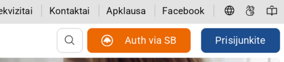

# LT VIISP -> Swedbank Auto
  

Автоматизация авторизации на госпорталах Литвы. Избавляет от необходимости прокликивать кучу страниц выбора банка.

### Скриншоты
| До (Before) | После (After) |
| :--- | :--- |
|  |  |

### Функционал
* Добавляет кнопку прямой авторизации "Auth via SB".
* Работает на: [Sodra](https://www.sodra.lt), [Migris](https://www.migracija.lt), [Esveikata](https://www.esveikata.lt).
* Поле ввода Smart-ID на странице банка запоминает последние введенные данные.
